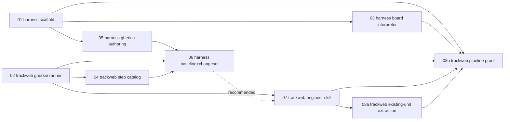

> # ⛔ ARCHIVED — this plan is dead; the backout is complete
>
> **As of 2026-08-18 this entire phase plan is stopped.** It executed
> [`../proposal.md`](../proposal.md)'s Gherkin-authoring approach, which put
> the LLM in the referee's chair for game rules and never produced a harness
> that was usable to design with. Phases 01–07 landed, 08a landed for two of
> four units, 08b never started — and all of it beyond the scaffold is being
> removed.
>
> - **Why, and what happens to each piece:** [`../STATUS.md`](../STATUS.md)
> - **Concrete removal plan:** [`../backout-plan.md`](../backout-plan.md)
> - **Replacement direction, still being evaluated and not approved:**
>   [`../turn-machines/README.md`](../turn-machines/README.md) (shared rules
>   engine + declarative unit language), plus a ground-up harness rebuild
>   around live multi-scenario simulation (TBD, not yet designed).
>
> The phase docs below stay accurate as a record of *what was built*; each
> carries its own **Status** and **Disposition**. Do not start new work from
> this plan.

# Dungeon-Harness Implementation Phases

Execution breakdown of [`../proposal.md`](../proposal.md) into 9 phases,
each scoped to **one repo** (`harness` or `track-web`) and sized to be a
single OpenSpec change in that repo. Mirrors the structure
`docs/introspect-harness/phases/` already uses for a multi-step harness
build.

Phase 08 was split into 08a/08b after realizing "write `.feature` files for
the existing units" is agent extraction work (prose spec + implementation →
Gherkin, no undecided behavior), not designer work — the original phase 08
routed it through the full harness design-session flow regardless. See
08a's "Why this isn't a harness design session" section.

These documents are the **planning breakdown**, not the OpenSpec changes
themselves — each phase becomes its own `openspec propose` in whichever
repo it's scoped to, when work on it starts.

## Phases

Every phase's current state and what happens to it. "Disposition" is
summarized from [`../STATUS.md`](../STATUS.md).

| # | Repo | Phase | Status | Disposition |
|---|---|---|---|---|
| 01 | harness | [Harness scaffold](phase-01-harness-scaffold.md) | ✅ Complete | **Keep** — substrate-independent |
| 02 | track-web | [Gherkin test runner](phase-02-trackweb-gherkin-runner.md) | ✅ Complete | **Keep, frozen** — Gherkin not removed yet |
| 03 | harness | [Board & local rules interpreter](phase-03-harness-board-interpreter.md) | ✅ then ❌ already reverted | Gone — deleted by `dungeon-board-tool-enhancements` |
| 04 | track-web | [Step catalog generator](phase-04-trackweb-step-catalog.md) | ✅ Complete | **Delete** |
| 05 | harness | [Gherkin authoring core](phase-05-harness-gherkin-authoring.md) | ✅ Complete | **Delete** |
| 06 | harness | [Baseline, changeset & read-only track-web access](phase-06-harness-baseline-changeset.md) | ✅ Complete | **Delete** |
| 07 | track-web | [Engineer skill: scenario → OpenSpec change](phase-07-trackweb-engineer-skill.md) | ✅ Complete | **Delete** |
| 08a | track-web | [Existing-unit Gherkin extraction (agent-driven)](phase-08a-trackweb-existing-unit-extraction.md) | ⚠️ Partial (melee, rogue only) | **Keep features**, unwind capability split |
| 08b | track-web | [Pipeline proof (real harness session)](phase-08b-trackweb-pipeline-proof.md) | ❌ Never started | Moot |

## Ordering (historical)

The dependency graph as planned. Retained to explain how the built pieces
relate; not a plan to follow.

**Parallelizable pairs:** 01 and 02 have no dependencies on each other and
can start simultaneously (different repos). Once 01 lands, 03 and 05 are
independent of each other (board/interpreter vs. Gherkin parse/render) and
can proceed in parallel; 04 (track-web) can proceed alongside both once 02
is done. 06 is the first point work in the two repos actually has to
converge — it needs both harness-side authoring (05) and track-web-side
plumbing (02, 04) to exist.

**07's dependency on 06 is soft, not hard.** 07 can be drafted directly
against the artifact shapes already fixed in `proposal.md` (`.feature` +
changeset + implementation notes) without 06's code existing yet — but
verifying it end-to-end needs a real handoff bundle, which only 06
produces. Sequence 07 after 06 unless there's a reason to parallelize.

**08a is agent extraction, not a design session.** These 4 units' behavior
is already fully pinned down by `openspec/specs/pc-archetypes/spec.md`'s
existing prose scenarios and the passing implementation — writing their
`.feature` files is a format conversion an agent does directly in
track-web, no harness session, no board preview. It only depends on 02 and
07 (this repo's phases 01/03/05/06 aren't needed at all for 08a).

**08b is the payoff, the first real run of the whole pipeline** — board
tools, chat-driven session, sign-off, phase 07's skill, archive,
step-catalog regeneration, next session reading it back — and it's gated on
08a specifically because diffing against an *empty* baseline (what 08a
produces internally) never exercises `modified`/`removed` classification.
08b needs 08a's real baseline to be a meaningful test. Both are explicitly
scoped as partially-throwaway work (today's simple `UnitDef` shape, not the
not-yet-built archetype system) — see `proposal.md`'s "Archetype scope"
section for why that trade is worth taking. Expect 08a to split into
several small OpenSpec changes (roughly one per unit or small batch) rather
than landing as a single change.
