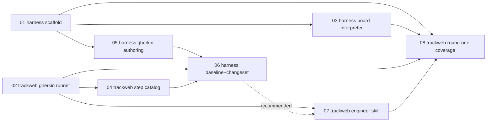

# Dungeon-Harness Implementation Phases

Execution breakdown of [`../proposal.md`](../proposal.md) into 8 phases,
each scoped to **one repo** (`harness` or `track-web`) and sized to be a
single OpenSpec change in that repo. Mirrors the structure
`docs/introspect-harness/phases/` already uses for a multi-step harness
build.

These documents are the **planning breakdown**, not the OpenSpec changes
themselves — each phase becomes its own `openspec propose` in whichever
repo it's scoped to, when work on it starts.

## Phases

| # | Repo | Phase | Depends on |
|---|---|---|---|
| 01 | harness | [Harness scaffold](phase-01-harness-scaffold.md) | — |
| 02 | track-web | [Gherkin test runner](phase-02-trackweb-gherkin-runner.md) | — |
| 03 | harness | [Board & local rules interpreter](phase-03-harness-board-interpreter.md) | 01 |
| 04 | track-web | [Step catalog generator](phase-04-trackweb-step-catalog.md) | 02 |
| 05 | harness | [Gherkin authoring core](phase-05-harness-gherkin-authoring.md) | 01 |
| 06 | harness | [Baseline, changeset & read-only track-web access](phase-06-harness-baseline-changeset.md) | 05; track-web 02, 04 |
| 07 | track-web | [Engineer skill: scenario → OpenSpec change](phase-07-trackweb-engineer-skill.md) | 02; recommended after 06 |
| 08 | track-web | [Round-one Gherkin coverage (existing units)](phase-08-trackweb-round-one-coverage.md) | all of 01–07 |

## Ordering

**Parallelizable pairs:** 01 and 02 have no dependencies on each other and
can start simultaneously (different repos). Once 01 lands, 03 and 05 are
independent of each other (board/interpreter vs. Gherkin parse/render) and
can proceed in parallel; 04 (track-web) can proceed alongside both once 02
is done. 06 is the first point work in the two repos actually has to
converge — it needs both harness-side authoring (05) and track-web-side
plumbing (02, 04) to exist.

**07's dependency on 06 is soft, not hard.** 07 can be drafted directly
against the artifact shapes already fixed in `proposal.md` (`.feature` +
changeset + implementation notes) without 06's code existing yet — but
verifying it end-to-end needs a real handoff bundle, which only 06
produces. Sequence 07 after 06 unless there's a reason to parallelize.

**08 is the payoff, not infrastructure.** It's the first real run of the
whole pipeline, gated on everything above, and is explicitly scoped as
partially-throwaway work (today's simple `UnitDef` shape, not the
not-yet-built archetype system) — see `proposal.md`'s "Archetype scope"
section for why that trade is worth taking. Expect 08 itself to split into
several small OpenSpec changes (roughly one per unit or small batch) rather
than landing as a single change — sized by what actually comes out of each
harness session, not fixed in advance.
