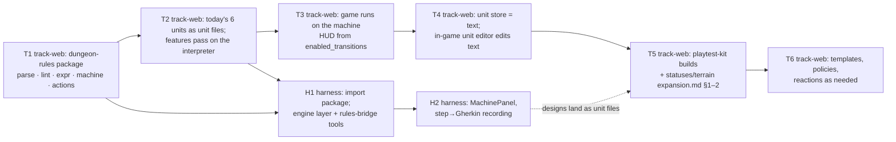

# Migration: from the partial implementation to turn machines

Two repos, one interpreter. This is the order of operations that gets there
without a big-bang, keeps today's game playable at every step, and lets the
harness become useful early. Each phase is sized to be one OpenSpec change
in whichever repo it touches (same convention as `../phases/README.md`).

Contents:

1. [Where things are today](#1-where-things-are-today)
2. [Package placement](#2-package-placement)
3. [Phases](#3-phases)
4. [What gets superseded, archived, or re-pointed](#4-what-gets-superseded-archived-or-re-pointed)
5. [Risks and how the phasing handles them](#5-risks-and-how-the-phasing-handles-them)

---

## 1. Where things are today

**track-web / `client-games/src/games/dungeon-tactics-solo/`**

- A working game: Phaser scene, HUD, `GameState` with `planningPhase`,
  `movedThisTurn`, `attackedThisTurn`, undo stack; `pc.ts` implements
  "move up to range in pieces, one attack, attack locks the unit"; `npc.ts`
  is the brute policy; `attackFootprint.ts` does `single|line|plus`
  footprints; `pathfinding.ts` BFS/A*.
- `UnitDef` is a small JSON (`maxHp`, `movement.range`, one `attack`)
  persisted in SQLite (`game_unit_defs`), editable live in-game via
  `defStore.ts` — old-framework Stage 2.
- Phase 02 landed: `.feature` files run under Vitest via quickpickle
  (`npm run test:dungeon-tactics`), step definitions in `features/steps/`,
  a `steps-catalog.json` (phase 04).
- Design docs describe a *much* richer target (`unit-definition.md`,
  concepts, playtest kit) that no code implements yet — and the design
  conversation summary already leaned toward "archetype registry +
  scenario runner" as the next refactor.

**harness / `dungeon-harness-server` + `client-dungeon`**

- Auth, one `AgentSession`, jailed workspace, chat UI (phase 01).
- Board = freehand `objects[]` + generic draw tools; the rule-aware
  `board-engine/` was deleted (`dungeon-board-tool-enhancements`).
- Gherkin authoring core (phase 05) and baseline/changeset (phase 06)
  exist; `dungeon-board-rules-engine` and `dungeon-preview-lifecycle` are
  open and stalled on exactly the question this folder answers.

## 2. Package placement

The interpreter must be importable by both repos and by the game *without
Phaser*. Recommendation:

```
track-web/
  packages/
    dungeon-rules/                 # NEW workspace package, pure TS, zero deps
      src/
        parse/     lexer, parser → AST; pretty-printer
        lint/      type-check, termination, warnings
        expr/      evaluator + board-query bindings
        machine/   run loop, transitions, hooks, undo/snapshot
        actions/   attack.md resolution (targeting/propagation/effect/forced movement)
        board/     GameState, pathfinding, LOS, terrain table   ← moved from client-games
        policy/    player (external), brute_ai (moved from npc.ts)
      test/        unit tests + the playtest-kit archetypes as fixtures
```

- `track-web` already has a `packages/` tier (`ui`, `auth`, `config`), so
  this is the established pattern, not a new one.
- `client-games` imports it; the Phaser scene and HUD become renderers over
  `GameState` + `enabled_transitions`.
- `harness` imports it **read-only** — `file:../track-web/packages/dungeon-
  rules` for local dev (the sibling checkout the exploration doc notes), or
  a published tarball/version later. This is exploration-doc option B, and
  the "what happens when the archetype system lands" caveat disappears
  because the package *is* the archetype system.
- No `packages/` tier in `harness` (its CLAUDE.md says don't build one
  speculatively; nothing here needs it).

Text-first storage (README open question 1): the DB column that holds
`UnitDef` JSON today holds unit-file text; the package's parser validates
on write. A JSON AST export exists for tooling but isn't stored.

## 3. Phases



### T1 — `dungeon-rules` package (track-web)

The interpreter, standalone, test-driven, no game wiring:

- lexer/parser for the unit-file syntax (`machine-definition.md` §1–§10)
  and the terse action form (§10.6) — *or* actions-as-JSON inside a
  textual unit file, per README open question 2 (decide at proposal time;
  the archetype files assume terse);
- expression evaluator with the §9 built-ins, backed by a `BoardQuery`
  interface the game state implements;
- lint (§13) including the termination check;
- the run loop (§11), hooks (§7), snapshot/undo (§12);
- `attack.md` resolution ported from `attackFootprint.ts`/`pc.ts`
  `resolveAttack` and extended to the full targeting/propagation/effect
  model with expressions in numeric fields and forced movement/collisions
  per the playtest §2 table;
- **fixtures**: every unit file in `archetypes/*.md` parses, lints as
  documented (including the two lint *failures* called out — the Thief's
  unbounded dagger, the free stance switch), and its trace table runs
  step-for-step as a test.

Exit: `npm test -w packages/dungeon-rules` green; no game change.

### T2 — today's units as unit files (track-web)

Write `melee`, `ranger`, `magic-user`, `rogue`, `short-range`,
`long-range` as unit files against **today's** rules (fighter-shaped: move
in pieces up to range, one attack, attack locks). Run the existing
`melee.feature`/`rogue.feature` (phase 08a's extractions) through the
package via a thin adapter in `features/steps/`. Both engines answer the
same until T3 flips.

Exit: features pass on the interpreter; behaviour diff vs. `pc.ts` is
empty on the scenarios.

### T3 — the game runs on the machine (track-web)

Replace `planningPhase`/`movedThisTurn`/`attackedThisTurn`/`hasAttacked`
with per-unit machine state from the package; `ActionButtons`/`Hud` render
`enabled_transitions` (buttons, greyed reasons); the scene highlights
reachable tiles / legal targets from the same call; `npc.ts` becomes the
`brute_ai` policy; telegraphs unchanged. Delete `pc.ts` planning code that
the machine now owns. Old `UnitDef` JSON still loads via a shim that
generates a fighter-shaped unit file, so nothing in the DB has to change
yet.

Exit: the game plays identically for today's six units; `npm run
test:dungeon-tactics` green; the shim is the only place the old shape
survives.

### H1 — harness imports the package; engine layer + tools (harness)

The resumption of `dungeon-board-rules-engine`, per `harness-integration.md`
§3 and §8: engine layer in `board-state.ts`, `rules-bridge.ts` with the
authoring/driving/asking tools, freehand kept, workspace `AGENTS.md`
teaching the language and the "always query" rule. `BoardCanvas` renders
the engine layer. `dungeon-preview-lifecycle` archived as superseded.

Depends on T1 (the package) and T2 (real unit files to load). Doesn't
depend on T3 — the harness can be running the interpreter before the game
is.

Exit: the README's Anchor/Fury dialogue is reproducible in a real session:
edit → lint → step → query, board always derived.

### H2 — machine panel + recording (harness)

`MachinePanel` (graph, resources, text with lint markers), snapshot
scrubber, and `dungeon_step` log → Gherkin scenario recording; step catalog
regenerated from transition kinds + action ids; handoff bundle carries unit
files. `scenario-to-change` (phase 07) accepts unit files.

Exit: 08b's "pipeline proof" re-run with a *new* rule (not an extraction):
designer session → unit file + features → engineer lands both.

### T4 — unit store is text; in-game editor edits text (track-web)

DB column stores unit-file text; the live editor panel becomes a text
editor with lint (a small subset of the harness panel), or just a
read-only view + "edit in the harness." Remove the T3 shim.

### T5 — playtest-kit builds + status/terrain definitions (track-web)

The four playtest archetypes and the brutes/archer/harpy as shipped units;
`expansion.md` §1 (statuses) and §2 (terrain rules) — the smallest set that
the playtest kit needs: `poisoned`, `frozen/rooted`, `marked`; `wall`,
`mountain`, `fire`, `forest`, `water`, `pit`, `caltrops`, `trap`. This is
where the harness starts paying off: these are authored *in sessions* and
land as files.

### T6 — templates, policies, reactions (track-web, as needed)

`extends` templates once there are enough tunings to want them; a
one-ply-lookahead policy when a playtest wants smarter brutes;
`redirect_telegraph` and/or reactions if the Anchor's enrage-now is
wanted. Each is its own change, each demanded by a design need, none
speculative.

## 4. What gets superseded, archived, or re-pointed

| Item | Fate |
|---|---|
| `harness/openspec/changes/dungeon-board-rules-engine` | **re-pointed** at H1; its proposal's four questions are answered in `harness-integration.md` §7; write design/specs/tasks from there |
| `harness/openspec/changes/dungeon-preview-lifecycle` | **archived as superseded** by H1 (derived views can't go stale) |
| `harness/docs/dungeon-harness/phases/phase-03-harness-board-interpreter.md` | superseded by H1 — the "local rules interpreter" is now the shared package |
| `harness/docs/dungeon-harness/proposal.md` "single canonical artifact" | **revised** per `harness-integration.md` §6; the rest stands |
| `track-web/docs/…/units/unit-definition.md` | its data model is subsumed: `archetype` + `params` → machine + resources; keep it as the record of *why* the shell/attack model looks the way it does, add a pointer here |
| `track-web/docs/…/units/movement.md` `range` | moves to resources (`machine-definition.md` §1) |
| `track-web/docs/…/units/design-conversation-summary.md` §4–5 (archetype registry, scenario runner) | the registry becomes templates; the scenario runner *is* the interpreter driven by Gherkin steps — both intents preserved, neither built as described |
| `pc.ts` planning/turn code, `npc.ts` | absorbed by the package (T3) |
| `UnitDef` JSON + `defStore.ts` | replaced by unit-file text (T4) via a shim from T3 |

## 5. Risks and how the phasing handles them

- **The syntax is wrong in some way we only find by using it.** T1's
  fixtures are the six archetype files; H1 puts it in front of the
  designer before the game depends on it (T3). Two rounds of "this reads
  badly" happen before anything is load-bearing.
- **The interpreter and the Phaser game disagree.** T2 runs both engines
  on the same features before T3 removes one. The features are the diff.
- **`attack.md` resolution is the biggest chunk of T1.** It's also the
  most tested piece of *today's* code (`attackFootprint.test.ts`, the
  features) and the playtest kit §2 is a precise spec for forced movement
  and collisions. Port, don't reinvent; keep the tests.
- **Expressions tempt scope creep** ("just add strings," "just add a
  loop"). `machine-definition.md` §8 is the fence; `expansion.md` §7 is
  the list of what's on the other side. Anything new goes through the
  same "named primitive after a conversation" rule.
- **The harness team (one person) is also the game team.** The phasing is
  T1 → (T2, H1 in parallel) → T3 → H2 → T4… so the harness is usable
  after three changes, and the game keeps working the whole time.
